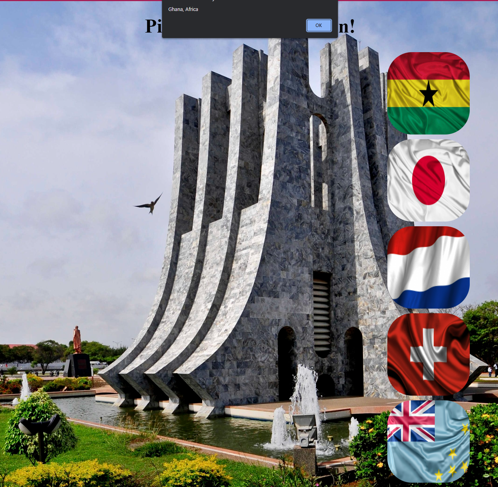

# VacaPicker

First JS project without using a tutorial! - Uploaded to see progress over the next few months

## Table of contents

- [Overview](#overview)
  - [Screenshot](#screenshot)
- [My process](#my-process)
  - [Built with](#built-with)
  - [What I learned](#what-i-learned)
  - [Continued development](#continued-development)
  - [Useful resources](#useful-resources)
- [Author](#author)

## Overview

Created a vacation picker based off the YouTube picker created and demostrated by Leon Noel of #100Devs in the class 12 video.

### Screenshot



This is a screenshot of one of the locations listed on the vacation picker. Visible after clicking on the flag.

## My process

Determined what theme I wanted to use for my project. Because a vacation would be nice, I decided to use places I would love to visit. From there, I searched for images that I found appealing. Because I'm not familiar with writing text outside of the console, I decided to use the alert function JS offeres. The helpe with notifying the user of the location.

### Built with

- HTML5
- CSS
- JavaScript

### What I learned

Some things I learned while completing this project are:

- Query Selectors
- Event Listeners
- Functions

The code I'm particularly proud of:

```JS
  function vacaGhana() {
    document.querySelector("body").style.background = "url('img/Ghana.png') center / cover"
    alert ("Ghana, Africa")
}
```

Very first function that I wrote without following a tutorial. I'm able to understand what is happening and why it's needed. In addition, I was able to utlizied the MDN to determine how I could change the background with a picture rather than a color.

### Continued development

Things I will continue to focus on:

- CSS
- JavaScript
- GitHub

### Useful resources

- [Class 12 Video](https://www.youtube.com/watch?v=_A20kVsaqIk) - The intro to JavaScript video
- [MDN](https://developer.mozilla.org/en-US/) - Helped with CSS and JS questions I had while completing this. Gives explanations and examples. Great resource for all.
- [#100Devs](https://leonnoel.com/100devs/) - Information on #100Devs and Leon Noel

## Author

- GitHub - [AvionShea](https://github.com/AvionShea)
- LinkedIn - [Avion Cobb](https://www.linkedin.com/in/avion-cobb/)
- Twitter - [@Avion_Cobb](https://www.twitter.com/Avion_Cobb)
- Frontend Mentor - [@AvionShea](https://www.frontendmentor.io/profile/AvionShea)
- Website - [Avion Cobb](https://avionshea.github.io/)
